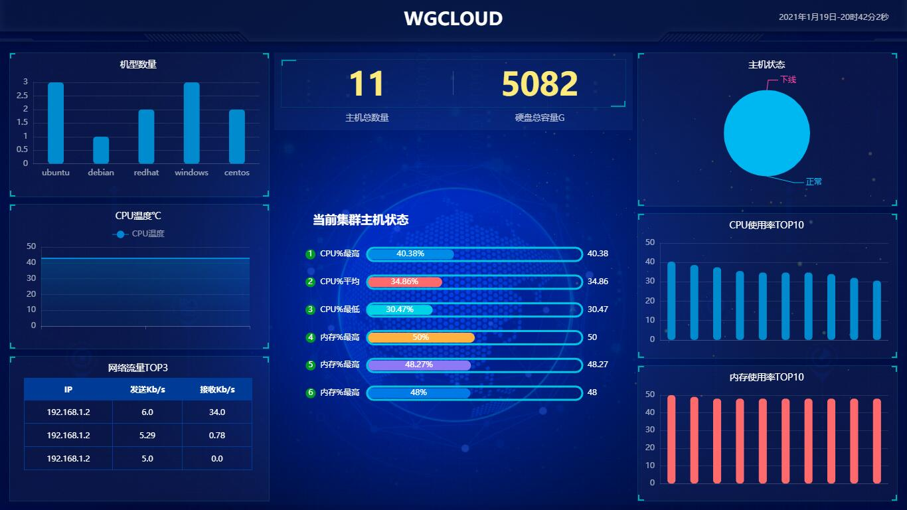

  
 

## WGCLOUD介绍

WGCLOUD设计思想为新一代极简运维监控系统，提倡快速安装，降低运维学习成本，全自动化运行，无模板和脚本。当前仓库版本为v2.3.6。

WGCLOUD基于轻量级springboot架构，是高性能高并发的分布式监控系统，核心模块包括：**主机监控，ES集群管理，CPU监控，CPU温度监控，大屏可视化展板，内存监控，数据监控(mysql，oracle，pg等)，服务心跳检测，应用进程管理，磁盘空间和IO监控，硬盘smart健康检测，系统负载监控，网络拓扑图，端口监控，日志文件监控，docker监控，监控告警信息（可集成微信钉钉短信等方式）推送**。[english readme](<./README_en.md>)

1.采用服务端和客户端协同工作方式，更轻量，更高效，后可支持5000+台主机同时在线监控。

2.server端负责接受数据，处理数据，生成图表展示。agent端默认每隔30秒(时间可调)上报指标数据。

3.支持主流服务器平台安装部署，如Linux, Windows, Solaris, AIX, HP-UX等。

4.WGCLOUD采用springboot+bootstrap，完美实现了分布式监控系统，为反哺开源社区，二次开源。

5.v2即当前仓库为开源版，**v3为商业版（有免费版和专业版）**，商业版功能更多，性能更优秀，请点击查看[开源商业版区别](<./开源商业版区别.md>)

## **网站**

<http://www.wgstart.com>

## **演示**

打开<http://www.wgstart.com>后，在网站顶部点击【演示】链接即可，免密登录

## **源码使用**

1.因wgcloud使用springboot框架开发，需要分别新建maven工程wgcloud-server和wgcloud-agent

2.然后将wgcloud-server和wgcloud-agent下的源码和pom文件，分别拷贝到刚新建的工程wgcloud-server和wgcloud-agent里，覆盖对应的目录

3.运行所需sql脚本（本项目使用mysql数据库），在sql文件夹下，在mysql数据库里创建数据库wgcloud，导入wgcloud.sql即可。

4.wgcloud-agent运行所需sigar的so，dll等文件，在sigarLibs.zip里，解压后可用，注意配置开发工具的VM参数：-Djava.library.path=E:\wgcloud-agent-v2.3\lib。

**5.如果WGCLOUD帮助到了你，请在[www.wgstart.com](http://www.wgstart.com/help/docs4.html)打赏支持下，有你的支持开源才能做的更好**

## **功能截图**

## 运行环境

1.JDK1.8

2.mysql5.6 或 5.7

3.跨平台，linux：内核版本2.6.23或更高，CentOS/RHEL 6.0以上。windows：windows server 2003以上

## 联系

邮箱：tianshiyeben@qq.com

## 感谢

JetBrains提供的免费license