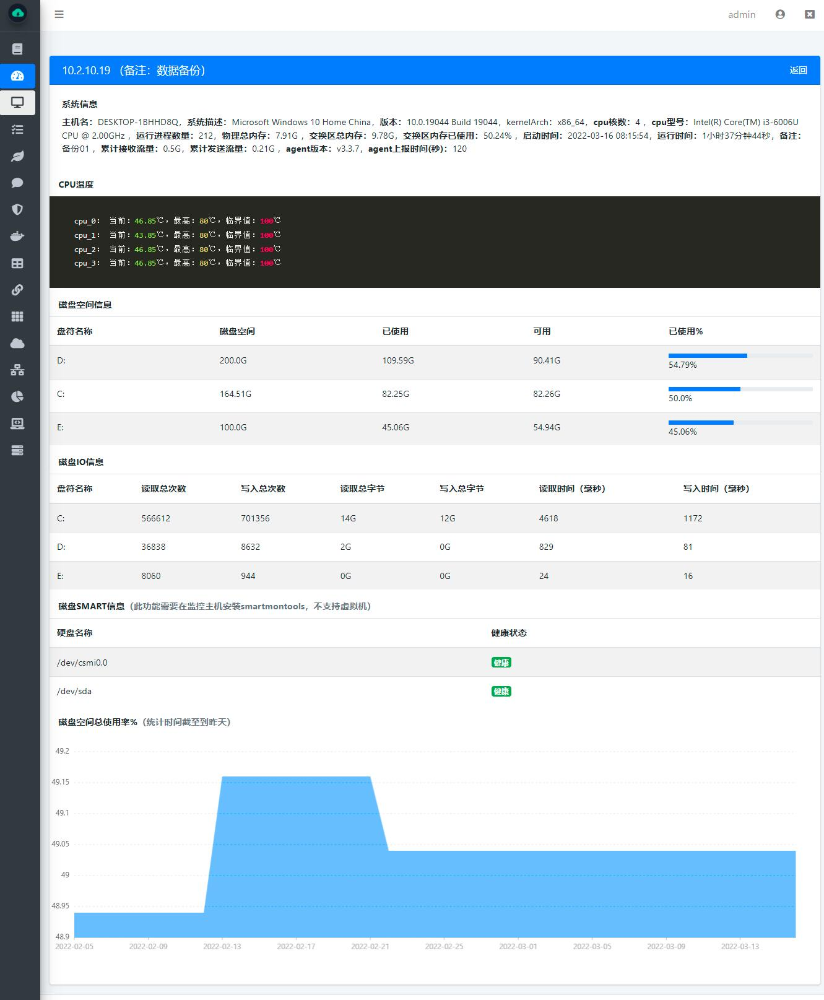
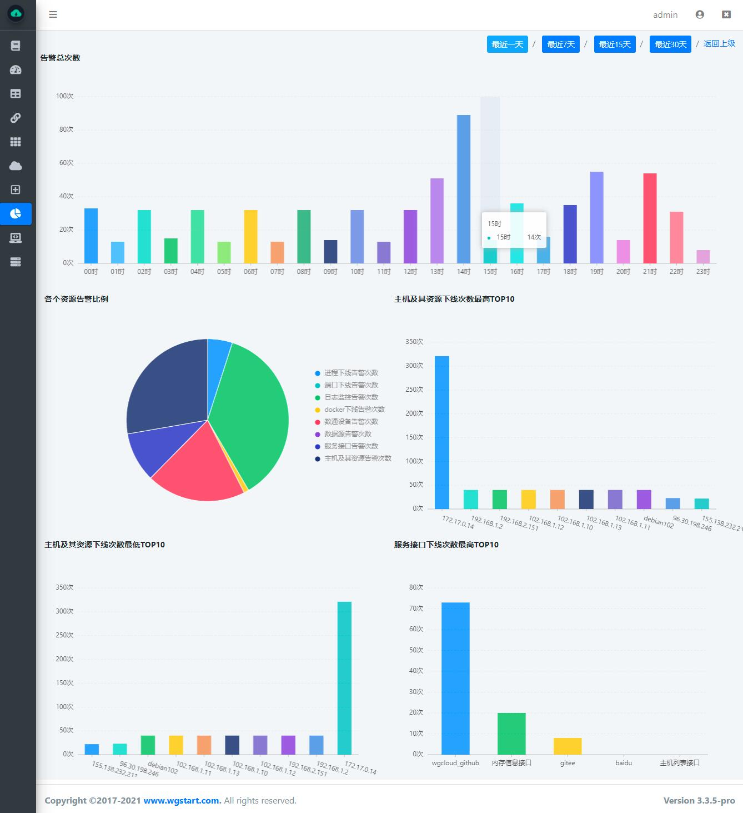
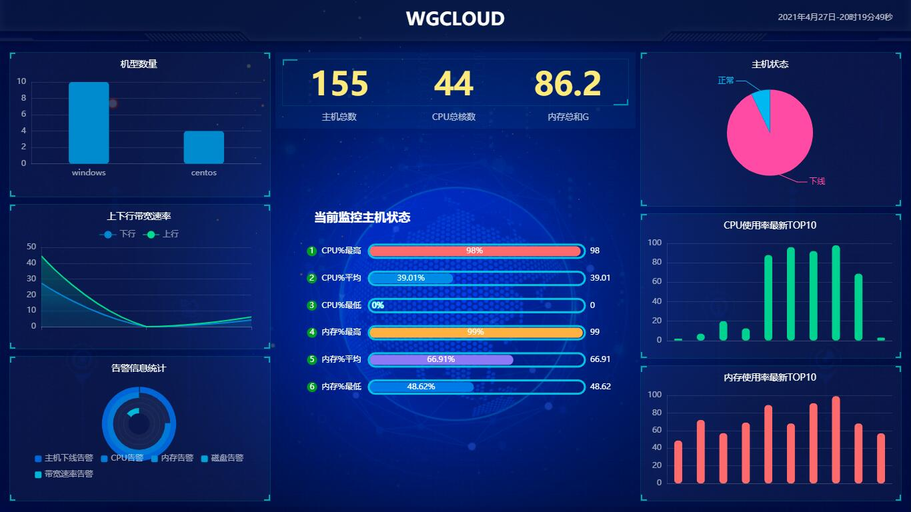
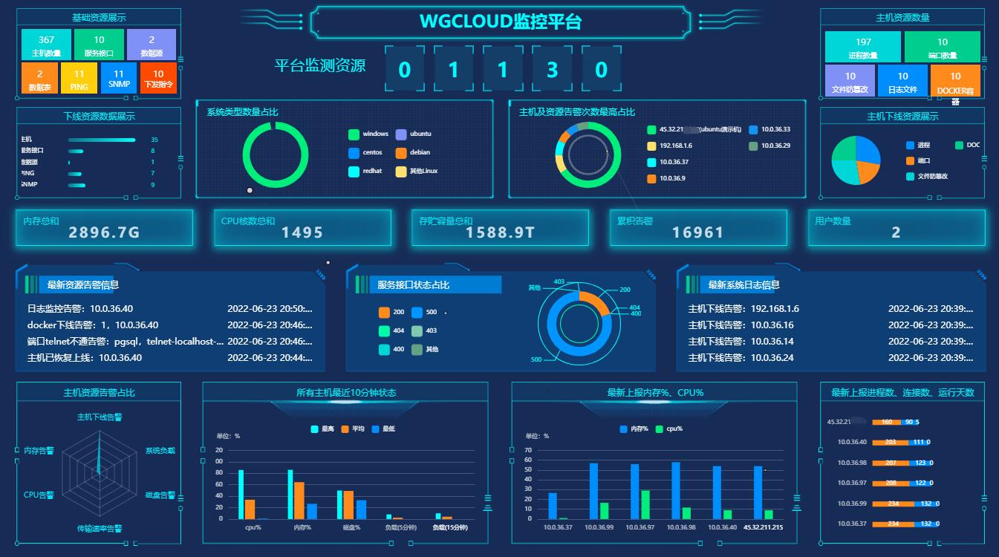
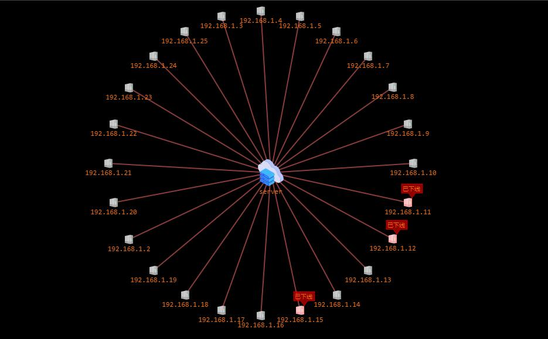
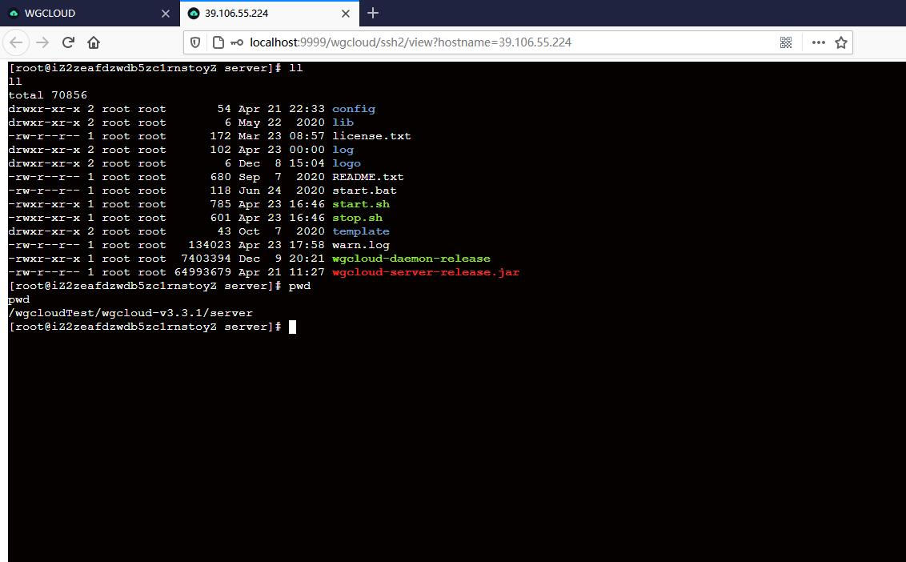
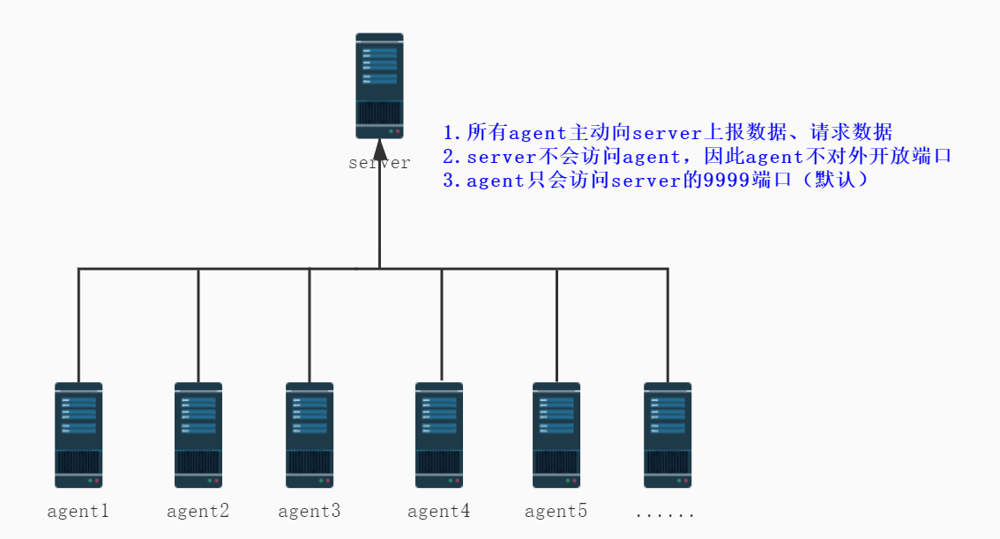

  
 

## WGCLOUD介绍

WGCLOUD设计思想为新一代极简运维监控系统，提倡快速部署，降低运维学习难度，全自动化运行，无模板和脚本。

**当前仓库为开源版本v2.3.7最新，二次开发请拉取master分支即可**。

WGCLOUD基于微服务springboot架构开发，是轻量高性能的分布式监控系统，核心采集指标包括：**cpu使用率，cpu温度，内存使用率，磁盘容量，磁盘IO，硬盘SMART健康状态，系统负载，连接数量，网卡流量，硬件系统信息等。支持监测服务器上的进程应用、文件防篡改、端口、日志、DOCKER容器、数据库、数据表等资源。支持监测服务接口API、数通设备（如交换机、路由器、打印机）等。自动生成网络拓扑图，大屏可视化，web SSH（堡垒机），统计分析图表，指令下发批量执行，告警信息推送（如邮件、钉钉、微信、短信等）**。[English Readme](<./README.md>)

1.v2.3.7放弃了之前版本的sigar方式获取主机指标，采用流行的OSHI组件来采集主机指标

2.采用服务端和代理端协同工作方式，更轻量，更高效，可支持数千台主机同时在线监控

3.server端负责接受数据，处理数据，生成图表展示。agent端默认每隔2分钟(时间可调)上报主机指标数据

4.支持主流服务器平台安装部署，如Linux, Windows,macOS,Unix等

5.WGCLOUD采用主流技术框架SpringBoot+Bootstrap，完美实现了分布式监控系统，为反哺开源社区，二次开源

6.**当前仓库为开源版，v3.x版本为商业版（免费但不开源哈），生产环境建议部署商业版**，商业版功能、性能更优秀

7.如果您觉得WGCLOUD帮助到您的工作，那不用打赏我们，star支持下就好了

8.关于分享，我们开源的初衷在于分享学习，如果可以的话，请在您的博客、网站（如果有的话）帮忙加个[WGCLOUD](http://www.wgstart.com)链接或写个论坛帖子分享给更多的小伙伴，我们将非常感谢。最后若您愿意的话，可以将您单位名称通过邮件发来给我们，我们将展示到WGCLOUD网站的【感谢】栏目

## **唯一官网**

<http://www.wgstart.com>

## **Github**仓库

<https://github.com/tianshiyeben/wgcloud>

## **视频**

B站WGCLOUD相关视频地址，<https://space.bilibili.com/549621501/video>

## **源码使用**

1.使用IDEA的话（推荐），直接打开wgcloud-server和wgcloud-agent即可，JDK使用1.8

2.使用Eclipse的话，导入maven工程wgcloud-server和wgcloud-agent即可，JDK使用1.8

3.运行所需sql脚本（本项目使用mysql数据库），在sql文件夹下，在mysql数据库里创建数据库wgcloud，导入wgcloud.sql即可

4.bin目录下的脚本文件，为server和agent启动/停止脚本（linux和windows），和打包好的wgcloud-server-release.jar放到同一个目录下即可。

## **功能截图**

## 通信图示例（http协议）

## 运行环境

1.JDK版本：JDK1.8、JDK11

2.数据库：MySql5.5及以上、MariaDB、PostgreSQL、Oracle

3.支持系统平台

> 支持监测Linux系列：Debian，RedHat，CentOS，Ubuntu，Fedora，SUSE，麒麟，统信(UOS)，龙芯(mips)等
>
> 支持监测Windows系列：Windows Server 2008 R2，2012，2016，2019，2022，Windows 7，Windows 8，Windows 10，Windows 11
>
> 支持监测Unix系列：solaris，FreeBSD，OpenBSD
>
> 支持监测MacOS系列：macOS amd64，macOS arm64
>
> 其他支持：ARM，Android(安卓)，riscv64，s390x，树莓派等

## 联系

邮箱：**wgcloud@foxmail.com**

## 赞助支持

https://www.wgstart.com/docs19.html

## 技术交流群

https://www.wgstart.com/docs9.html

## 感谢

JetBrains提供的免费license