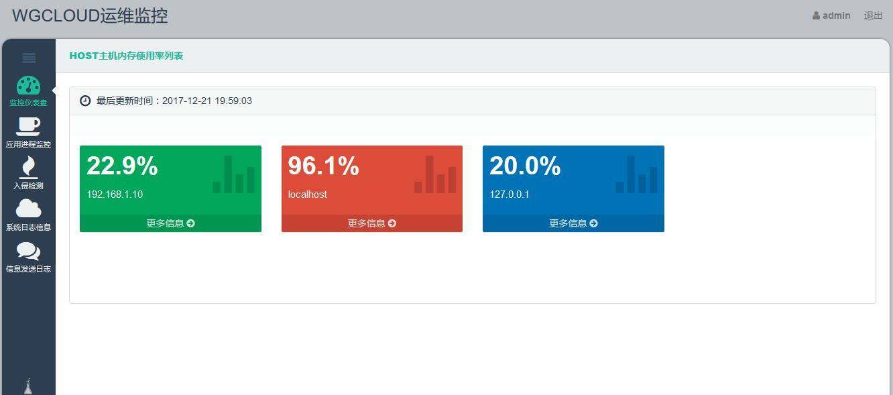
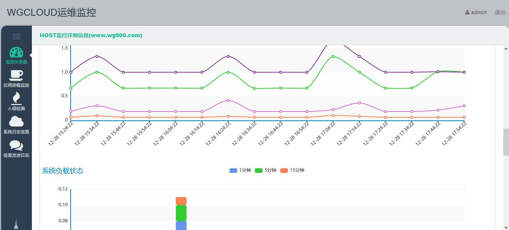
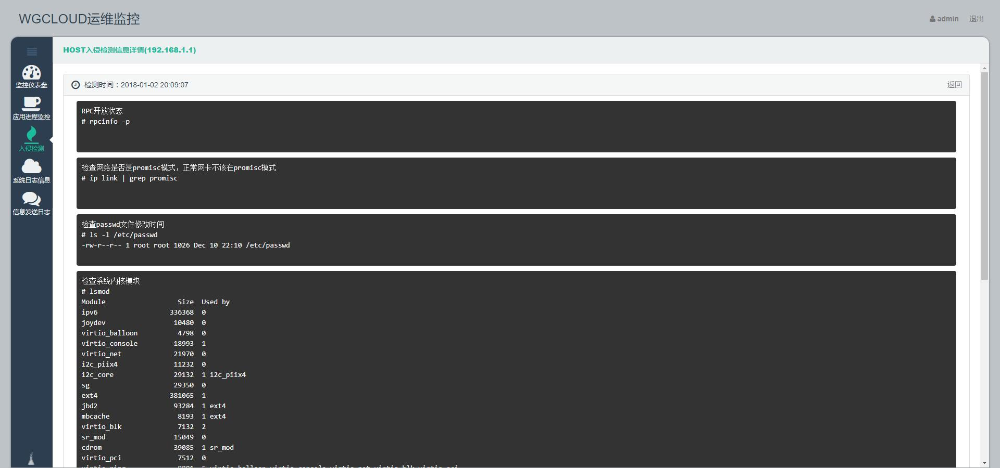

## WGCLOUD

Linux performance monitoring tools, operation and maintenance monitoring, network throughput, server CPU monitoring, memory monitoring







## Dependent environment

1.JDK1.8

2.tomcat8.5+

3.mysql5.6+

4.CentOS 6.4 or above, Red Hat 6.4 or above, not supported by other systems

5.Check whether the monitored HOST host has installed sysstat. The following information indicates that it has been installed. If not, please install it through Yum install sysstat.

```
[root@localhost ~]# mpstat
Linux 3.10.0-514.el7.x86_64 (localhost.localdomain) 	2019年01月10日 	_x86_64_	(4 CPU)

13时40分26秒  CPU    %usr   %nice    %sys %iowait    %irq   %soft  %steal  %guest  %gnice   %idle
13时40分26秒  all    0.60    0.00    0.19    0.16    0.00    0.03    0.00    0.00    0.00   99.02
```


## Source code usage

To build a new web Maven project with eclispe, use SRC to replace the SRC directory of the new project, use pom. XML to replace the pom. XML in the new project, and set jdk.

SQL folder is the database creation script. Create a new database named dats in MySQL and execute the dats. SQL script

Application. properties, configure database link information

Host. properties, configure monitoring server information in the format of IP = port // username // password, you can configure more than one, try not to use root account

Because the application will get the running status from the target server by configuring the host. properties information, the monitored server does not need to install the application.

## Monitoring index

```
%usr: User CPU time (%)
%sys: core time (%)
%idle: idle time (%)
%iowait: IO wait time (%)
Rxpck/s: Packets received per second
Txpck/s: Packets sent per second
RxkB/s: KB received per second
TxkB/s: KB sent per second
Active/s: The number of locally initiated TCP connections per second, both created through connection calls
Pasve/s: Number of remotely initiated TCP connections per second, that is, TCP connections created through accept calls
%CPU: Process occupancy CPU utilization
%MEM: Percentage of physical and total memory used by processes
R/s, w/s, rkB/s, wkB/s: Represents the number of reads and writes per second and the amount of reads and writes per second (kilobytes), respectively. Excessive reading and writing may cause performance problems.
Await: The average waiting time for an IO operation in milliseconds. This is the time spent by applications interacting with disks, including IO waiting and actual operation.
If this value is too large, it may be that the hardware device has encountered bottlenecks or malfunctions.
Avgqu-sz: The average number of requests to the device. If this value is greater than 1, it may be that the hardware device is saturated (some front-end hardware devices support parallel writing).
%util: Equipment utilization. This value indicates the busyness of the device, and the empirical value is that if it exceeds 60, it may affect IO performance (referring to the average waiting time for IO operations).
If it reaches 100%, the hardware is saturated.
```


## How to delete the server information when the connection fails

The server empties the failed server information every three days, so you can't see the failed server information after three days. At present, manual operation is not supported, all of which are handled automatically by the system.


At the same time, the system will regularly clear the monitoring information 30 days ago.

## Warning prompt rule

The threshold of system memory usage is 99%. If it exceeds sending mail, it will not be repeated 24 hours.

The alarm percentage threshold of process memory monitoring is 99%. If the alarm percentage exceeds the sending mail, it will not be repeated 24 hours.

Process CPU usage monitoring alarm percentage threshold of 99%, more than sending mail, 24 hours will not be repeated.

If you don't want to receive alert notification, you can turn off the alert in applications. properties.

## Access address

http://localhost:9000/wgcloud

Login account/password：admin/111111

## contact

email：tianshiyeben@qq.com

