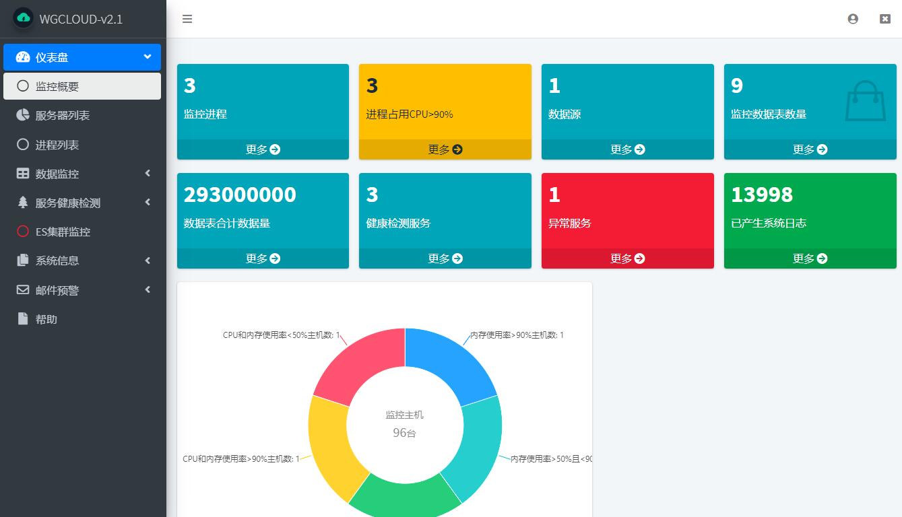
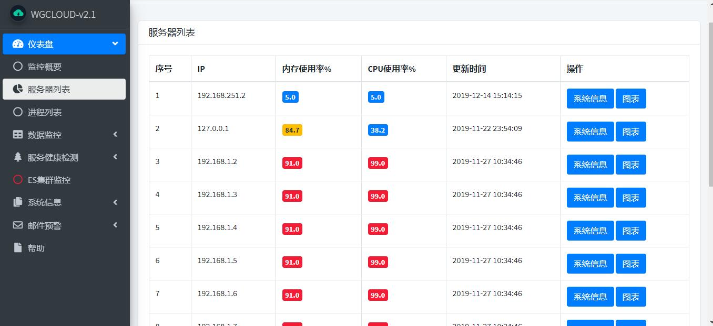
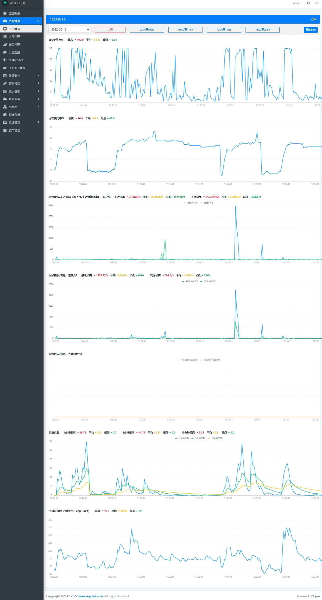

  
 

## WGCLOUD-v2.3.5

WGCLOUD基于java语言开发，是高性能高并发的分布式监控平台，核心模块包括：服务器集群监控，ES集群监控，CPU监控，内存监控，数据监控(mysql，oracle，pg等)，服务心跳检测，应用进程管理，磁盘IO监控，系统负载监控，监控告警信息推送。[english readme](<https://github.com/tianshiyeben/wgcloud/blob/master/README_en.md>)

1.采用服务端和客户端协同工作方式，更轻量，更高效，可支持数百台服务器在线监控。

2.server端负责接受数据，处理数据，生成图表展示。agent端负责定时上报指标数据。

3.支持主流服务器平台安装部署，如Linux, Windows, Solaris, AIX, HP-UX等。

4.运行所需sigar的so，dll文件，请下载安装包，在wgcloud-agent/lib文件夹下。

5.运行所需sql脚本，在安装包里，解压后就能看到。

6.WGCLOUD采用微服务springboot+bootstrap，完美实现了分布式监控系统，为反哺开源社区，二次开源。

## **下载**

<http://www.wgstart.com>

## **DEMO**

## 运行环境

1.JDK1.8

3.mysql5.6 或 5.7

## 联系

tianshiyeben@qq.com

## 支持开源

如果您觉得本应用项目对你有帮助，可以赞赏一下作者。万水千山总是情，一块十块都是情！

